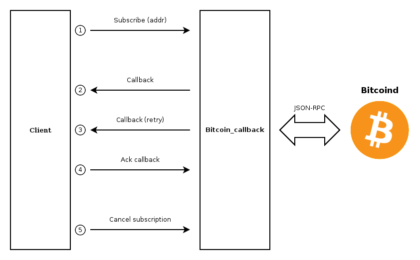

# Bitcoin Callback

Bitcoin-callback is a bitcoin monitoring and notification micro-service, it provides
a simple RESTful API to subscribe to bitcoin addresses, and receive notifications when
there is a transaction from or to one of them.

These notifications are POST requests to the URL provided by the subscription.


## Overview



1. Subscribe to one or more bitcoin addresses, the client must provide a 
   notification URL and an optional expiration date.

2. When a transaction to or from a subscribed address is detected bitcoin 
   callback 'sends' a notification to the subscription url.

3. A notification is retrasmited periodically until the client acknowledges
   it's reception, or retry limit is reached.

4. Client acknowledges the callback

5. The subscription is terminated by the client, the other way to terminate
   a subscription is to wait until the expiration date is reached.


## API

### Subscribe

To subscribe to a Bitcoin address, send a POST request to **/subscription** with the
format:

```
Request Headers

    Content-Type: application/json

Request Body

    {
        "address": "n4r9Ko71tH6t75iM4RuBwXKRn77vNiFBrb",
        "callback_url": "http://client_domain.com/post/url",
        "expiration": "2017-04-01T05:26:35"
    }
```

| Name           | Type        | Description                           | Required  |
|:-------------- |:------------|:------------------------------------- |:----------|
| address        | String      | Bitcoin address to monitor            | true      |
| callback_url   | String      | Url where the callback is sent        | true      |
| expiration     | Integer     | Expiration datetime iso8601(UTC)      | false     | 

Successful response:

```
Response Headers

    Content-Type: application/json; charset=utf-8
    status: 202 Accepted

Response Body
    {
        "id": 33,
        "address": "n4r9Ko71tH6t75iM4RuBwXKRn77vNiFBrb",
        "callback_url": "https://client_domain.com/post/url",
        "created": "2017-04-01T01:26:35",
        "expiration": "2017-04-01T05:26:35",
        "state": "active",
    }
```

###### Curl example

```bash
$ curl -X POST -H "Content-Type: application/json" -d '{"address":"mjgZHpD1AzEixLgcnncod5df6CntYK4Jpi", "callback_url":"http://client.com/calback/url"}' "http://service.com/subscription"
```


### Subscription Details

To show a subscription, send a GET request to **/subscription/$SUBSCRIPTION_ID**

```
Request Header
	
	Content-Type: application/json
``` 

```
Response Headers
	
	Content-Type: application/json; charset=utf-8
	Status: 200 Ok

Response Body:
	
    {		
        "id": 33,
        "address": "n4r9Ko71tH6t75iM4RuBwXKRn77vNiFBrb",
        "callback_url": "https://client_domain.com/post/url",
        "created": "2017-01-01T01:26:35",
        "expiration": 2017-04-01T01:26:35,
        "state": "canceled",
    }
```

| Name           | Type        | Description                                               |
|:-------------- |:------------|:--------------------------------------------------------- |
| id             | Integer     | Subscription id                                           |
| address        | String      | Bitcoin address to monitor                                |
| callback_url   | String      | Url where the callback is sent                            |
| created        | String      | Creation datetime iso8601(UTC)                            |
| expiration     | Integer     | Expiration datetime iso8601(UTC)                          |
| state          | String      | Subscriptions state (ready, canceled, expired, suspended) |


###### Curl example

```bash
$ curl -X GET -H "Contente-Type: application/json" "http://192.168.1.2:8000/subscription/55"
```


### Cancel Subscription

There are two ways to stop a subscription, wait until the expiration date or send a PATCH request 
to **/subscription/$SUBSCRIPTION_ID**

```
Request Headers

    Content-Type: application/json

Request body
    {
        "state": "canceled"
    }
```

The response status will indicate success (200 - Ok), and include the subscription in the body

```
Response Headers

    Content-Type: application/json; charset=utf-8
    Status: 200 Ok

Response Body
	
    {
        "id": 33,
        "address": "n4r9Ko71tH6t75iM4RuBwXKRn77vNiFBrb",
        "callback_url": "https://client_domain.com/post/url",
        "created": "2016-04-01T12:44:01",
        "expiration": "2017-04-01T01:26:35",
        "state": "canceled",
    }
```

###### Curl example

```bash
$ curl -X PATCH -H "Content-Type: application/json" "http://service.com/subscription/33" -d {"state": "canceled"}"
```


### List Subscriptions

To list all subscriptions, send a GET request to **/subscription**

```
Request Headers

    Content-Type: application/json
```

The response body will be a JSON object with an array containg objects representing each
address

```
Response Headers

    Content-Type: application/json; charset=utf-8
    Status: 200 Ok

Response Body
    {
        subscriptions: [
            {"id": 33, "address": "mjgZHpD1AzEixLgcnncod5df6CntYK4Jpi", "callback_url": "...."},
            {"id": 34, "address": "1F1tAaz5x1HUXrCNLbtMDqcw6o5GNn4xqX", "callback_url": "...."},
            {"id": 35, "address": "14SJiZvXHzFLQH3ibqNF8A7orcCiXFNzWX", "callback_url": "...."},
        ]
    }
```

Supported query paramenters:

	page (integer): Page number (default 0)
	per_page (integer): Results per page (default 5)
	address (string): Subscription bitcoin address (1-50)
	state (string): A subscription state (active, canceled, expired, suspended)
		


###### Curl example

```bash
$ curl -X GET "http://service.com/subscription?page=1"
```

```bash
$ curl -X GET "http://service.com/subscription?status=active"
```

### Pagination

All request returning an object list, will also include pagination fields, with the usual
meaning.

```
{
    "paging": {
        "prev": "http://service.com/subscription?page=2&per_page=4"
        "next": "http://service.com/subscription?page=4&per_page=4"
    }
}
```


### Sending Callbacks

Once a transaction involving a subscribed address is detected a POST request is issued to 
**"callback_url"**, with the following format.

```
Request Headers

    Content-Type: application/json

Request Body

   {
        "id": "51253edb-1652-4907-b4dc-934bccfe2dbe",
        "subscription": { 
            "id": 23,
            "address": "15dZHeERPS6rnDgq9Rr2CVdZN4oHEDqyvd"
        },
        "created": "2017-01-01T01:26:35",
        "txid": "8cde57ed1b9d7ced7b9d5adc32bb77b9aa6cce63280e93d56b48b37b7982b131",
        "amount": 7481310,
        "retries": 2,
        "acknowledged": False
    }
```

Expected response

```
Response Headers

    Content-Type: application/json; charset=utf-8
    Status: 200 Ok or 202 Accepted
```

| Name           | Type          | Description                                         |
|:-------------- |:------------- |:--------------------------------------------------- |
| id             | String        | Unique id for the callback                          |
| subscription   | Object        | Embedded subscription object                        |
| created        | Integer       | Callback creation time (iso8601)                    |
| txid           | String        | Bitcoin transaction hash (hexadecimal)              |
| address        | String        | One of the transaction inputs/outputs               |
| amount         | Integer       | Amount transfered to/from the address               |

Embedded Subscription:

| Name           | Type          | Description                                         |
|:-------------- |:------------- |:--------------------------------------------------- |
| id             | Integer       | Subscription id                                     |
| address        | String        | Bitcoin address being monitored by the subscription |


### Acknowledge Callback

Each callbacks is reissued until the retry limit is reached or it is acknowledged by the client sending a PATCH request to **/callback/$CALLBACK_ID**

```
Request Headers

    Content-Type: application/json

Request Body

    {
        "acknowledged": True
    }
```

```
Response Headers

    Content-Type: application/json; charset=utf-8
    Status: 200 Ok

```

###### Curl example

```bash
$ curl -X PATCH -H "Content-Type: application/json" -d '{"acknowledged": true}' "http://service.com/callback/callback_id"
```


### Callback Details

To show a callback, send a GET request to **/callback/$CALLBACK_ID**

```
Request Headers
	
    Content-Type: application/json
```

A successful response

```
Response Header

    Content-Type: application/json
    Status: 200 Ok

Response Body

    {
        "id": "51253edb-1652-4907-b4dc-934bccfe2dbe",
        "subscription": { 
            "id": 23,
            "address": "15dZHeERPS6rnDgq9Rr2CVdZN4oHEDqyvd"
        },
        "txid": "8cde57ed1b9d7ced7b9d5adc32bb77b9aa6cce63280e93d56b48b37b7982b131",
        "created": 1490471885,
        "amount": 7481310,
        "retries": 2,
        "acknowledged": false
    }
```


### Callback List

To list all callbacks, send GET request to **/callback**

```
Request Header

    Content-Type: application/json
```

Response

```
Response Header

    Content-Type: application/json
    Status: 200 Ok

Response Body

    {
      "callbacks": [
        {     
          "id": "790031db-8480-4f0f-9344-5a4cec5fbaee",   
          "subscription": {
              "id": 33,
              "address: "15dZHeERPS6rnDgq9Rr2CVdZN4oHEDqyvd"
          },
          "txid": "8cde57ed1b9d7ced7b9d5adc32bb77b9aa6cce63280e93d56b48b37b7982b131",
          "created": 1490471885,
          "amount": 7481310,
	  "retries": 2,
	  "acknowledged": False
        },
        {
          "id": "0999fd84-80cc-44a6-b3d1-9934fc790d31",
          "subscription": {
              "id": 33,
              "address": "1KuWLoZuoJgz3N6sLoAwGth9XGm8YuFTGt",
          },
	  "txid": "073bff6156cd7a5768e319c2ab8025283731ec5ac7da5fce638eeba569993398",
	  "created": 1490526357,
          "amount": 1384203713,
	  "retries": 2,
          "acknowledged": False
        },
      ]
    }
```

Optional query paramenters:

	subscription (integer): Callback subscription id
	acknowledged (boolean): Select acknowledged or unacknowledged callbacks


###### Curl example

```bash
$ curl -X GET "http://192.168.1.2:8000/callback?subscription=55"
```


